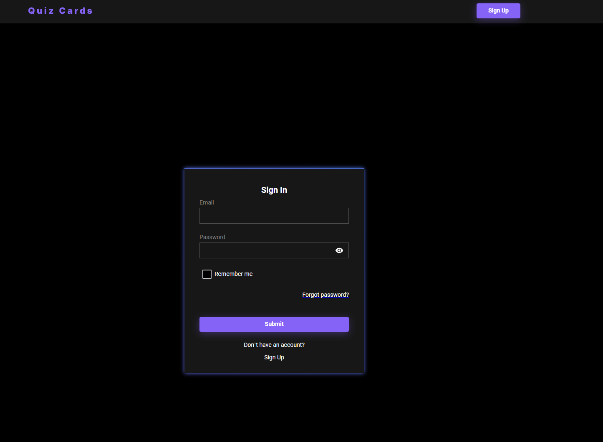
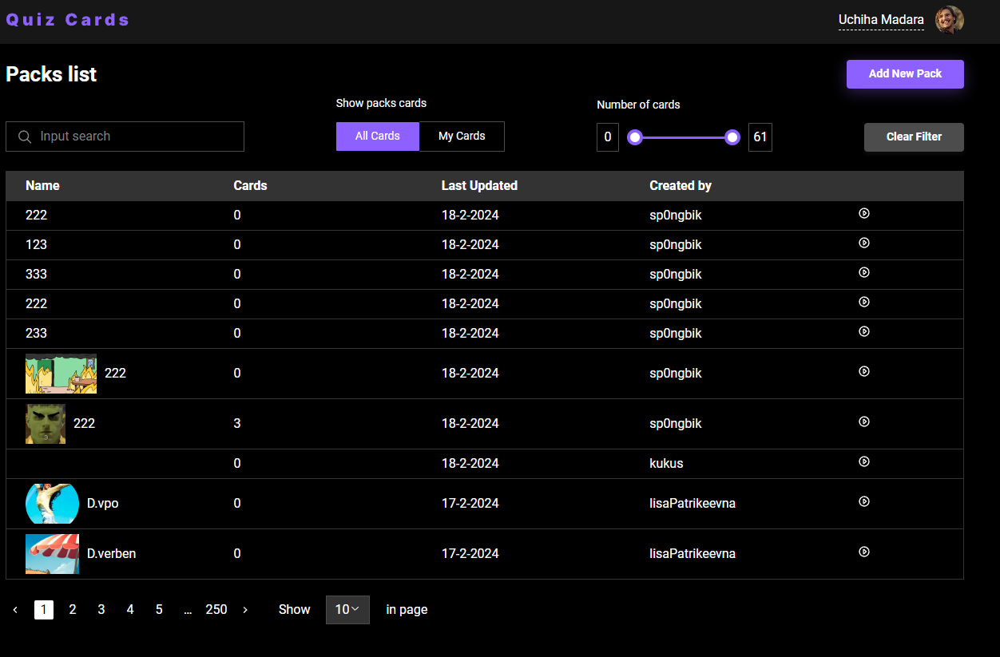

# 🧠 Flash Cards App (React + RTK Query)

**Flash Cards** is a learning platform where users can study using flash cards.  
You can create decks of cards to learn topics such as foreign languages, programming questions, or anything else — either using your own cards or cards from other users.

---

### 🔗 Live Demo

Check out the deployed version:  
👉 [**Flash Cards — Live Site**](https://flash-cards-ruby-two.vercel.app)


---

## 📸 Screenshots

### 📋 Login


### 🖥️ Homepage


---

## 📦 Features

- ✅ Registration, login, and password recovery
- ✅ View, search, and sort decks
- ✅ Filter decks using range slider (by number of cards)
- ✅ Create / Edit / Delete decks and cards
- ✅ Learn mode for cards
- ✅ View and edit user profile
- ✅ Upload profile photo
- ✅ Pagination and navigation
- ✅ Responsive design

---

## 🚀 Technologies Used

- **React**
- **Redux Toolkit & RTK Query**
- **TypeScript**
- **SCSS Modules**
- **React Router**
- **React Hook Form**
- **Zod** (for form validation)

---

## 🧑‍💻 Getting Started

### 1. Clone the repository

```bash
    git clone https://github.com/Dmytro-Doronin/flash-cards.git
    cd flash-cards
```

### 2.  Install dependencies

```bash
   pnpm install
```
### 3.  Run the development server

```bash
   pnpm run dev
```